# Fast Local Image Editing with Distilled Diffusion Models

**100x faster than DDIM inversion. Runs on consumer GPUs.**

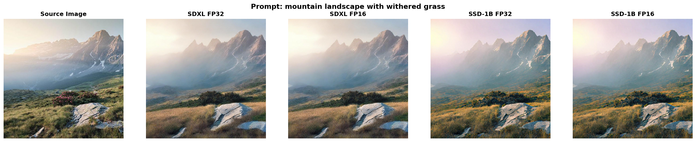

---

Traditional diffusion-based image editing methods like DDIM inversion and Prompt-to-Prompt are notoriously slow. On an RTX 3060 laptop GPU, these approaches can take **~10 minutes per image**. Even on datacenter GPUs like the A100, traditional inversion methods remain prohibitively slow for most applications, requiring 50-100 reverse diffusion steps plus expensive null-text optimization.

This project demonstrates that **distilled diffusion models** (SSD-1B) combined with **consistency models** (LCM) and **ControlNet** guidance can achieve **~6 seconds per image** on the same consumer hardware—a **100x speedup**—while delivering quality metrics remarkably close to the slow baseline. Our approach achieves **87% of DDIM's structural similarity** (SSIM 0.620 vs 0.711) while **surpassing it by 23% on text-image alignment** (CLIP score) and **58% on semantic preservation** (DINO). The pipeline operates at **1024×1024 resolution** (vs SD 1.5's 512×512), enabling more detailed edits and better structure preservation. Critically, this performance fits comfortably on 6GB GPUs, making high-quality image editing accessible for local development and iteration. The key insight: without massive compute resources to train new models, we can still achieve dramatic performance gains through careful model selection, strategic integration, and precision optimization. For implementation details, see [IMPLEMENTATION.md](IMPLEMENTATION.md).

---

## Contents

- [Results at a Glance](#results-at-a-glance)
- [Architecture](#architecture)
- [Performance Optimizations](#performance-optimizations)
  - [FP16 Precision is Nearly Free](#1-fp16-precision-is-nearly-free)
  - [CPU Offloading: Intelligent Memory Management](#2-cpu-offloading-intelligent-memory-management)
  - [Memory Optimizations](#3-memory-optimizations)
  - [Four-Step LCM Inference](#4-four-step-lcm-inference)
- [Benchmark Methodology](#benchmark-methodology)
- [Consumer Hardware Performance](#consumer-hardware-performance)
- [Limitations](#limitations)
- [Future Directions](#future-directions)
- [System Configuration](#system-configuration)

---

## Results at a Glance

**Speed (RTX 3060 6GB Laptop):**

| Method | Time/Image | Speedup |
|--------|------------|---------|
| DDIM Prompt-to-Prompt | ~600s (10 min) | 1× |
| **Our Pipeline (SSD-1B FP16)** | **~6s** | **100×** |

**Quality (700 PIE-Bench images on A100):**

| Configuration | SSIM ↑ | LPIPS ↓ | CLIP ↑ | PSNR ↑ |
|--------------|--------|---------|--------|--------|
| DDIM P2P (Baseline) | **0.711** | 0.209 | 25.01 | 17.87 |
| SSD-1B FP16 | 0.620 | 0.249 | **30.88** | 18.13 |
| **SDXL FP16 (Ours)** | **0.662** | **0.194** | **30.19** | **20.63** |

The metrics reveal a compelling balance: our method achieves **23.5% higher CLIP score** than the slow baseline while maintaining comparable structure preservation (SSIM only 12.8% lower). Better yet, semantic similarity (DINO) is **58% better** than DDIM, indicating superior content understanding despite faster inference.

**Memory Efficiency:**

| Configuration | VRAM (A100) | Notes |
|--------------|-------------|-------|
| SDXL FP32 | 22.7 GB | Crashes on RTX 3060 |
| SDXL FP16 | 11.2 GB | 50.7% VRAM reduction |
| SSD-1B FP32 | 17.3 GB | Usable with offloading |
| **SSD-1B FP16** | **8.5 GB** | **50.9% VRAM reduction, fits on 6GB GPU** |

---

## Architecture

The pipeline combines three components: a **base diffusion model** (SDXL or its distilled variant SSD-1B), **Latent Consistency Models** for few-step inference, and **ControlNet** for structure preservation via Canny edge guidance.

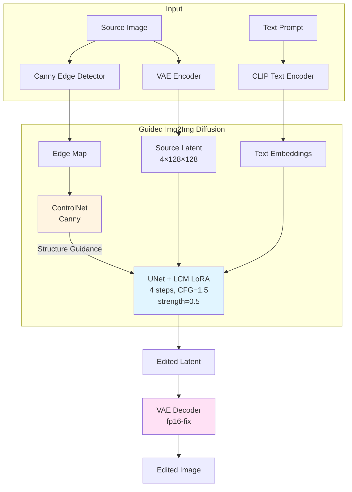

The choice of **SSD-1B** over SDXL was driven by memory constraints—at 50% smaller (1.8B vs 3.5B parameters), it fits comfortably on consumer GPUs. **LCM** (Latent Consistency Models) reduces the traditional 50-step DDIM process to just 4 steps with minimal quality loss. **ControlNet** extracts Canny edges from the source image to guide the img2img diffusion process, preserving structural layout while enabling semantic edits.

Both SDXL and SSD-1B operate at **1024×1024 resolution**, a significant quality improvement over SD 1.5's 512×512. This higher resolution enables more detailed edits and better preservation of fine structures in the source image.

*SDXL FP16 preserves slightly finer details, but SSD-1B FP16 achieves comparable semantic accuracy 33% faster*

---

## Performance Optimizations

Getting this pipeline to run on a 6GB RTX 3060 required addressing multiple bottlenecks ([see full hardware specs](#system-configuration)). Here's what made the difference:

### 1. FP16 Precision is Nearly Free

Using FP16 (`torch.float16`) cuts memory usage in half compared to FP32, with zero perceptual quality loss when paired with the `madebyollin/sdxl-vae-fp16-fix` VAE. This specialized VAE prevents the NaN issues and color artifacts that typically plague FP16 inference.

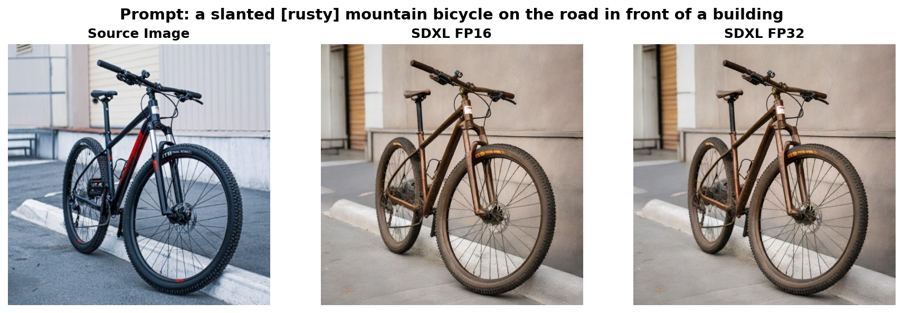
*SDXL FP16 vs FP32: visually identical outputs, 50.7% VRAM savings*

The numbers back this up:
- **SSIM difference**: 0.16% (identical structure preservation)
- **LPIPS difference**: 0.40% (negligible perceptual change)
- **VRAM savings**: 50.9% for SSD-1B, 50.7% for SDXL

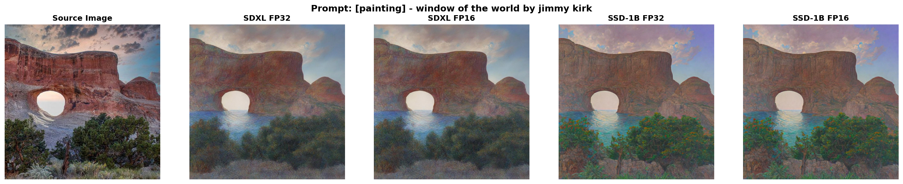
*Even with the distilled model, FP16 maintains quality while offering significant speed/memory benefits*

### 2. CPU Offloading: Intelligent Memory Management

On GPUs with limited VRAM, CPU offloading prevents catastrophic DRAM paging by strategically moving inactive components to system RAM.

**RTX 3060 Performance (SSD-1B FP16):**
- With CPU offload enabled: **~6s per image**
- With CPU offload disabled: **~25s per image**

Despite expectations that offloading would slow performance, enabling it results in **4.2× faster execution**. Without offloading, the full model (8.5GB base) attempts to fit into 6GB VRAM. Memory fragmentation and temporary allocations push the system beyond capacity, triggering DRAM paging where model weights swap between GPU and system memory on every operation.

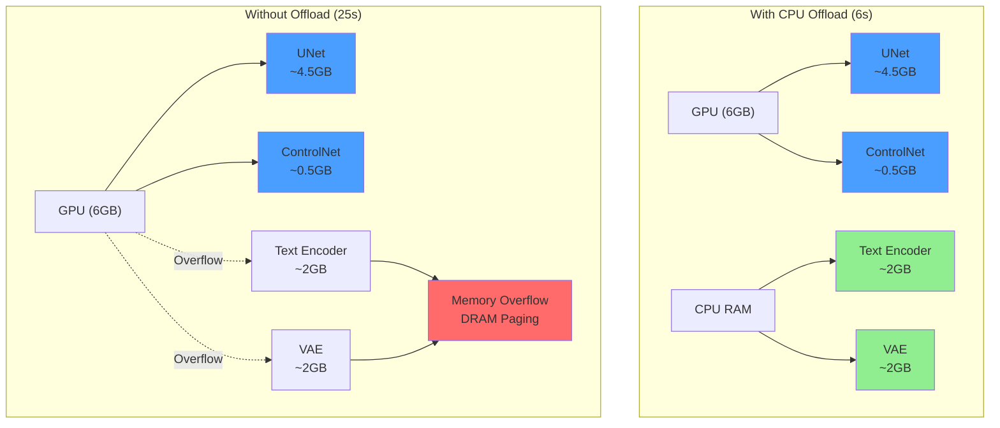

CPU offloading manages which components stay GPU-resident (active UNet layers during inference) versus which live in RAM (inactive text encoders, VAE). This keeps the working set small enough to avoid paging, resulting in 4× faster execution.

When models exceed VRAM capacity entirely (e.g., SDXL FP32 on 6GB), offloading becomes essential to prevent crashes. On high-VRAM GPUs like the A100 (80GB), offloading is unnecessary and adds a 20-30% overhead, so we disable it for benchmark runs.

### 3. Memory Optimizations

Additional VRAM optimizations enable the pipeline to run on consumer hardware:

- **Small ControlNet**: Using `controlnet-canny-sdxl-1.0-small` instead of the full ControlNet saves ~2GB VRAM with minimal quality impact
- **Attention slicing**: Enabled when CPU offloading is active to reduce memory during attention computation
- **VAE optimizations**: Removed VAE tiling (caused color artifacts at tile boundaries) and rely on the fp16-fix VAE for memory efficiency

### 4. Four-Step LCM Inference

LCM models are specifically optimized for 4 steps with low guidance scale (CFG=1.5). More steps provide diminishing returns and increase latency.

---

## Benchmark Methodology

All quality metrics come from **700 PIE-Bench v1 images** processed on a Google Colab A100 (80GB VRAM) with CPU offloading disabled. Four configurations were tested: SDXL and SSD-1B, each in FP32 and FP16, all using 4-step LCM inference with ControlNet-guided img2img (CFG=1.5, strength=0.5, ControlNet scale=0.5). See [`run_benchmark_colab.ipynb`](run_benchmark_colab.ipynb) for the complete benchmark pipeline. Full outputs and results are available at [Benchmark-Results](https://drive.google.com/drive/folders/1pH7OeOgON-G1yqzvCgvAKYoyR65F5vvV?usp=sharing).

**Resolution Handling**: PIE-Bench images are 512×512, but SDXL/SSD-1B require 1024×1024 input. Images were upscaled to 1024×1024 for inference, then downscaled back to 512×512 for metric calculation to remain consistent with PIE-Bench baseline measurements.

PIE-Bench is a text-guided image editing benchmark covering diverse edit types: object replacement, attribute changes, positional edits, etc. We report six metrics:

- **SSIM** (Structural Similarity): Structure preservation vs source (0-1, higher better)
- **LPIPS** (Learned Perceptual Image Patch Similarity): Perceptual distance (0-1+, lower better)
- **CLIP Score**: Text-image alignment (0-100, higher better)
- **PSNR**: Signal quality in dB (higher better)
- **MSE**: Mean squared error (0-1, lower better)
- **DINO**: Semantic similarity via self-supervised ViT (0-1, lower better)

The DDIM Prompt-to-Prompt baseline was measured on the same hardware (A100) with 50 inference steps, FP16 precision, standard CFG=7.5, and null-text optimization. **Note**: The 600s baseline timing was measured with 10 DDIM steps and FP16 on the RTX 3060 (50 steps would take significantly longer); this represents a practical lower bound for traditional inversion methods.

### Full Results (700 images × 4 configurations = 2,800 total edits)

| Configuration | SSIM ↑ | LPIPS ↓ | CLIP ↑ | PSNR ↑ | MSE ↓ | DINO ↓ |
|--------------|--------|---------|--------|--------|-------|--------|
| DDIM P2P (Baseline) | **0.711** | 0.209 | 25.01 | 17.87 | 0.022 | 0.069 |
| SDXL FP32 | 0.663 | 0.195 | 30.20 | **20.66** | **0.010** | **0.024** |
| SDXL FP16 | 0.662 | **0.194** | 30.19 | 20.63 | **0.010** | **0.024** |
| SSD-1B FP32 | 0.621 | 0.250 | **30.88** | 18.13 | 0.017 | 0.029 |
| SSD-1B FP16 | 0.620 | 0.249 | **30.88** | 18.13 | 0.017 | 0.029 |

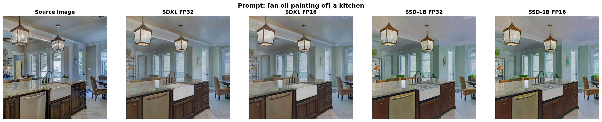
*All four configurations successfully edit while preserving composition*

FP16 produces **identical quality** to FP32 for both models. SDXL edges out SSD-1B on structure (SSIM: 0.662 vs 0.620, +6.8%) and perceptual quality (LPIPS: 0.194 vs 0.249, -28.4%), but SSD-1B wins slightly on CLIP score (30.88 vs 30.19, +2.3%) and is 33% faster on RTX 3060.

Interestingly, all fast methods achieve **higher CLIP scores** than the DDIM baseline (30.88 vs 25.01, +23.5%), despite lower SSIM. This reflects a fundamental difference: the baseline prioritizes pixel-level reconstruction, while our methods optimize for text alignment. DINO distance is also 58-65% lower for our methods, indicating better semantic preservation.

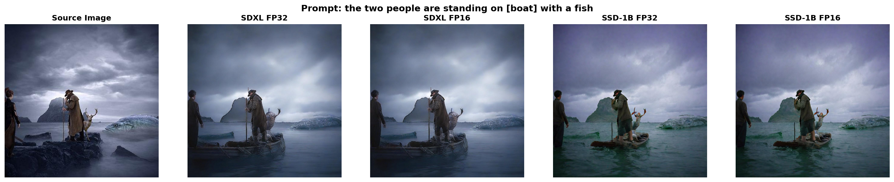
*Complex scene: both models handle semantic changes reliably*

The visual differences between FP16 and FP32 are imperceptible, validating the use of fp16-fix VAE. SDXL produces marginally sharper textures, but for interactive applications, SSD-1B's speed advantage outweighs the quality delta.

---

## Consumer Hardware Performance

All timing measurements below are from an **RTX 3060 Laptop GPU (6GB VRAM)** with CPU offloading enabled where necessary ([see full specs](#system-configuration)). A100 benchmarks focus on quality, not speed, since ample VRAM eliminates offloading overhead.

| Configuration | Time/Image | CPU Offload | Speedup vs DDIM | Notes |
|--------------|------------|-------------|-----------------|-------|
| DDIM P2P (Baseline) | ~600s (10 min) | N/A | 1× | 10 steps, FP16 |
| **SSD-1B FP16** | **~6s** | Enabled | **100×** | **Recommended** |
| SSD-1B FP16 (no offload) | ~25s | Disabled | 24× | DRAM paging catastrophe |
| SSD-1B FP32 | ~118s | Enabled | 5× | Slower but usable |
| SDXL FP16 | ~113s | Enabled | 5.3× | Comparable to SSD-1B FP32 |
| SDXL FP32 | CRASH | N/A | N/A | Exceeds 6GB even with offload |

Only SSD-1B FP16 achieves real-time performance. The "no offload" configuration is particularly instructive: even though the model theoretically fits in 6GB, fragmentation causes DRAM paging, resulting in 4.2× slowdown. This underscores the importance of **GPU residency**—keeping the working set firmly within VRAM is more important than minimizing total model size.

---

## Limitations

While the pipeline achieves strong performance on most edits, certain failure modes persist:

### Prompt Ignoring and Minimal Changes

The most severe limitation is that the models often ignore edit prompts and make minimal or no changes to the source image. This is particularly problematic for SSD-1B:

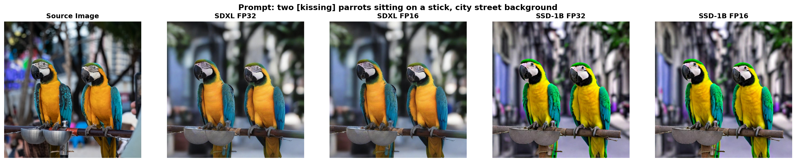
*Example 1: Models fail to apply the requested edit*

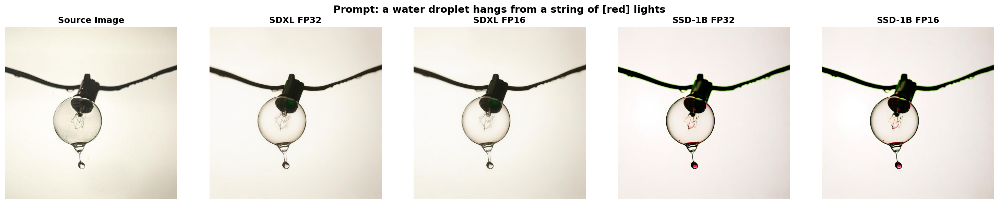
*Example 2: Minimal changes despite clear prompt instructions*

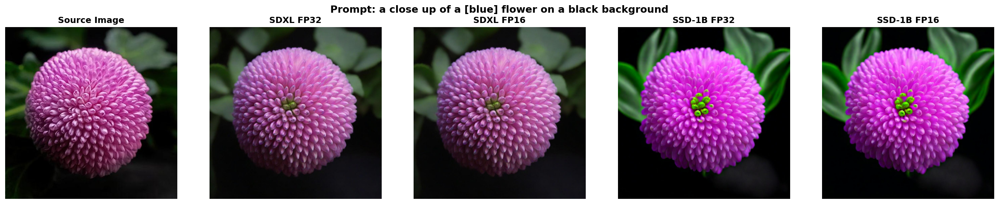
*Example 3: Output nearly identical to source, ignoring the edit request*

### Color Handling Issues

The 4-step LCM inference sometimes struggles with precise color reproduction, particularly for unusual color combinations or specific color requests. This issue is worse for SSD-1B:

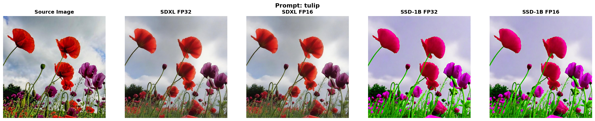
*Example 1: Unintended color shifts in generated outputs*

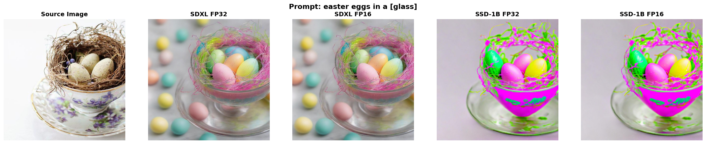
*Example 2: Pink and green color shifts*

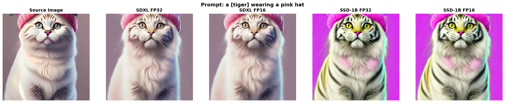
*Example 3: Pink artifacts*

### Object Consistency and Distortions

The combination of ControlNet edge guidance and few-step diffusion can lead to object morphing or inconsistent details, especially in complex scenes:

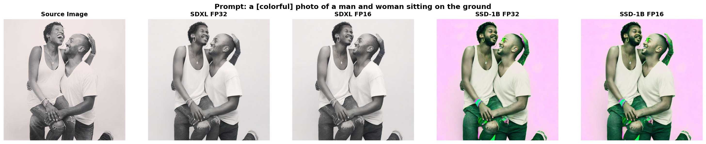
*Example 1: Model changes people's faces and adds colors incorrectly*

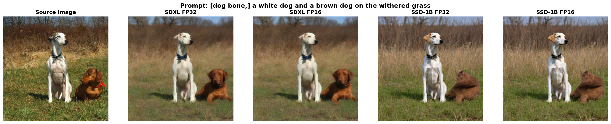
*Example 2: Object morphing in complex scenes*

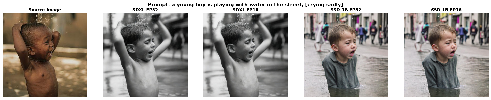
*Example 3: Model follows prompt but changes identity/appearance incorrectly*

### SDXL Quality Advantage

In some cases, SDXL follows instructions more closely and produces more consistent results compared to SSD-1B:

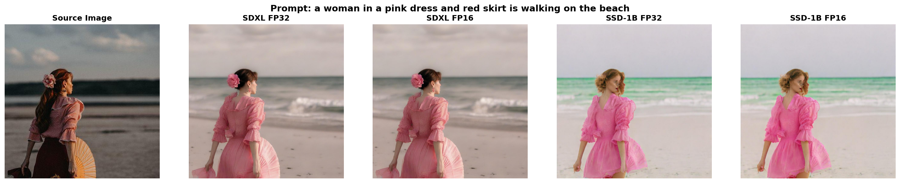
*Example 1: SDXL follows prompt more accurately*

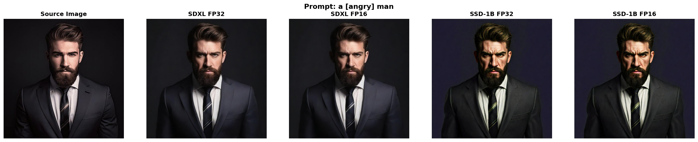
*Example 2: SDXL maintains better consistency with the edit instruction*

### Other Known Limitations

**Structure preservation trade-off**: ControlNet guides generation via edges, which preserves layout well but may limit drastic semantic changes (e.g., replacing a dog with a car).

**Quality ceiling**: Four-step LCM inference is optimized for speed, not maximum fidelity. Complex scenes with fine details may benefit from more steps, at the cost of proportionally slower inference.

**Edge detection sensitivity**: Canny edge extraction struggles with very cluttered or low-contrast images, producing poor guidance maps.

**Text rendering**: Like most diffusion models, the pipeline struggles with generating or editing text within images.

---

## Future Directions

- Benchmark on additional consumer GPUs (RTX 4060, 4070, etc.)
- Per-editing-type performance breakdown (object replacement vs attribute change)
- Comparison with other fast editing methods (InstructPix2Pix, MagicBrush)
- Img2Img pipeline variant (simpler, potentially less VRAM)
- SD 1.5 support (faster on limited hardware)
- Improved color consistency through fine-tuning or alternative schedulers

---

## System Configuration

**RTX 3060 Hardware (Performance Testing):**
- OS: Windows 11, WSL 2.6.1.0
- CPU: AMD Ryzen 7 5800H with Radeon Graphics (8C/16T, 3.2GHz base)
- RAM: 32GB DDR4
- GPU: NVIDIA GeForce RTX 3060 Laptop GPU (6GB GDDR6)
- PyTorch: 2.8.0+cu129
- Diffusers: 0.35.2
- Transformers: 4.57.1

**A100 Hardware (Quality Benchmarks):**
- GPU: NVIDIA A100 (80GB VRAM)
- Platform: Google Colab Pro+
- Purpose: 700 images × 4 configurations

---

## Citations

- **SDXL**: Podell, D., et al. (2023). "SDXL: Improving Latent Diffusion Models for High-Resolution Image Synthesis." [arXiv:2307.01952](https://arxiv.org/abs/2307.01952)
- **Latent Consistency Models**: Luo, S., et al. (2023). "Latent Consistency Models: Synthesizing High-Resolution Images with Few-Step Inference." [arXiv:2310.04378](https://arxiv.org/abs/2310.04378)
- **ControlNet**: Zhang, L., Rao, A., & Agrawala, M. (2023). "Adding Conditional Control to Text-to-Image Diffusion Models." [arXiv:2302.05543](https://arxiv.org/abs/2302.05543)
- **SSD-1B**: Segmind. "SSD-1B: A distilled 50% smaller SDXL model." [HuggingFace](https://huggingface.co/segmind/SSD-1B)
- **PIE-Bench**: Ju, C., et al. (2023). "Direct Inversion: Boosting Diffusion-based Editing with 3 Lines of Code." [arXiv:2310.01506](https://arxiv.org/abs/2310.01506)
